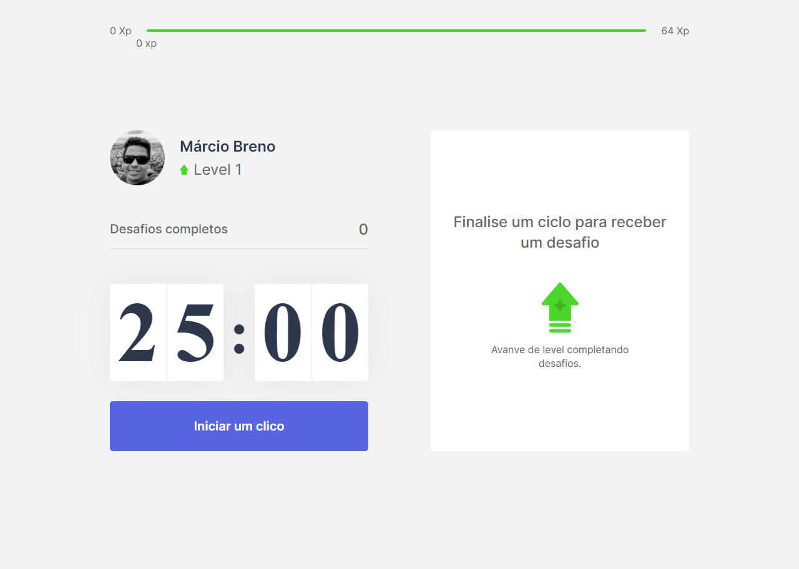

<h1 align="center">
  
</h1>

  <a href="#-next-level-week-04">Next Level Week 04</a>&nbsp;&nbsp;&nbsp;|&nbsp;&nbsp;&nbsp;
  <a href="#-tecnologias">Tecnologias</a>&nbsp;&nbsp;&nbsp;|&nbsp;&nbsp;&nbsp;
  <a href="#-projeto">Projeto</a>&nbsp;&nbsp;&nbsp;|&nbsp;&nbsp;&nbsp;
  <a href="#-como-executar">Como executar</a>&nbsp;&nbsp;&nbsp;|&nbsp;&nbsp;&nbsp;
  <a href="#-licença">Licença</a>

  

 

 

  

## 💻 Next Level Week 04

A Next Level Week - ReactJS é uma semana prática com muito código, desafios, networking com o único objetivo de elevar níveis.

O Foco aqui é compartilhar e absolver conteúdo para aprender novas ferramentas, conhecer novas tecnologias e descobrir hacks para dar aquele UP na carreira, Ah! e não podemos esquercer muita, muita prática!!!

Este projeto foi ministrado pelo [Diego Fernandes](https://github.com/diego3g 'Diego Fernandes').

[Rocketseat](https://rocketseat.com.br/ 'Rocketseat')

## ✨ Tecnologias

Esse projeto foi desenvolvido com as seguintes tecnologias:

- [React](https://reactjs.org)
- [Next.js](https://nextjs.org/)
- [TypeScript](https://www.typescriptlang.org/)

## 💻 Projeto

O move.it é um app que une a técnica de Pomodoro com a realização de exercícios físicos para quem passa muito tempo na frente do computador.

## 🚀 Como executar

- Clone o repositório
- Instale as dependências com `yarn`
- Inicie o servidor com `yarn dev`

Agora você pode acessar [`localhost:3000`](http://localhost:3000) do seu navegador.

## 📄 Licença

Esse projeto está sob a licença MIT. Veja o arquivo [LICENSE](LICENSE.md) para mais detalhes.

Feito com ♥ by Márcio Breno 👋🏻

